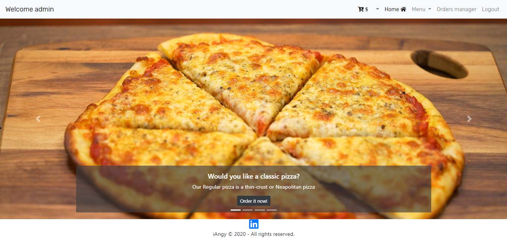

# Project 3

Web Programming with Python and JavaScript

This project is a funcional food ordering system made in django. Besides python I did use bootstrap 4 for better control of all elements. No javascript has been used.

index.html login.html registration.html menu.html extends layout.html file user_order.html and admin_order shows list of all orders

models.py contain all data structures urls.py contain routes to functions views.py cotain main program and fuctions which renders html files

Also in static/img folder there are pictures and style.css file which contain additional styling for html

Program automatically create superuser account at first start

Personal touch: allowing site administrator to mark orders as complete and allowing users to see the status of their pending or completed orders

The requirements for the project 3 are outlined here: https://docs.cs50.net/web/2020/x/projects/3/project3.html

# Screenshot

